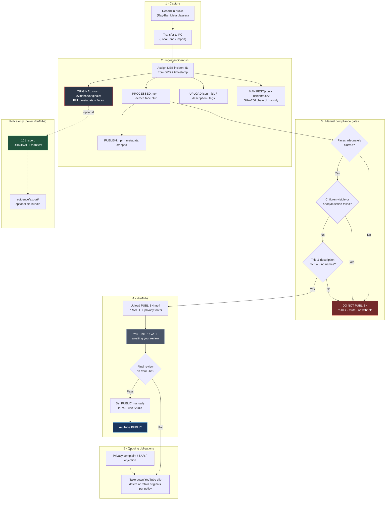

# Dangerous eBikers

Public documentation, compliance standards, and ingest tooling for the [@Dangerous-eBikers](https://www.youtube.com/@Dangerous-eBikers) YouTube channel — timestamped evidence of illegal pavement e-bike riding in the UK.

**Video evidence is never stored in this repository** (see `.gitignore`).

## Compliance & standards (public)

**Link this section from your YouTube channel About box.**

| Document | Audience | URL |
|----------|----------|-----|
| **[Compliance & standards statement](COMPLIANCE-STATEMENT.md)** | Complainants, YouTube, police | `https://github.com/ajlennon/dangerous-ebikers/blob/main/COMPLIANCE-STATEMENT.md` |
| [UK compliance record](UK-COMPLIANCE.md) | Full GDPR/legal operating detail | `https://github.com/ajlennon/dangerous-ebikers/blob/main/UK-COMPLIANCE.md` |
| [Publication workflow](#publication-workflow-privacy--compliance) | How clips are anonymised before going public | This README |

**Privacy / takedown / feedback:** [ajlennon@gmail.com](mailto:ajlennon@gmail.com)

We welcome constructive feedback to ensure we meet all legal and platform obligations.

## Publication workflow (privacy & compliance)

Mandatory path from capture to upload. **Never skip the manual gates.** Full legal context: [`UK-COMPLIANCE.md`](UK-COMPLIANCE.md).



| Stage | Privacy / legal control |
|-------|-------------------------|
| **ORIGINAL** | Never uploaded; gitignored; identifiable data retained only for police / defence |
| **PROCESSED** | Face blur (`deface`); human review before any publish decision |
| **PUBLISH** | No embedded GPS or device metadata; only this file goes to YouTube |
| **UPLOAD.json** | Factual text from templates; default **`private`**; set **`public`** in Studio after review |
| **MANIFEST** | Integrity hashes; documents what was shared with police |
| **Gates** | See [UK-COMPLIANCE.md §12](UK-COMPLIANCE.md#12-per-incident-checklist) checklist |
| **Complaints** | See [UK-COMPLIANCE.md §9](UK-COMPLIANCE.md#9-individual-rights--procedure) |

## Layout

```
dangerous-ebikers/
  branding/              Channel art and watermark (safe to keep in git)
  channel/               Copy-paste text for YouTube Studio
  evidence/
    originals/           Full metadata, identifiable faces — POLICE ONLY
    processed/           Face-blurred review copies + *_UPLOAD.json metadata
    publish/             Metadata-stripped — upload these to YouTube
    export/              Optional zip bundles for 101 handover
  register/
    incidents.csv        Master log (gitignored — copy from .example on first run)
    manifests/           Per-incident JSON with SHA-256 hashes
  scripts/
    ingest-incident.sh              Ingest pipeline
    regenerate-upload-metadata.sh   Rebuild *_UPLOAD.json from manifest
```

## Filename convention

Each incident gets a sequential ID and consistent prefix:

```
DEB-{UTC}_{LAT}_{LON}_{NNN}_{ROLE}.{ext}
```

Example:

```
DEB-20260623T080303Z_53.4092N_2.9778W_001_ORIGINAL.mov   ← police evidence
DEB-20260623T080303Z_53.4092N_2.9778W_001_PROCESSED.mp4  ← review (blurred)
DEB-20260623T080303Z_53.4092N_2.9778W_001_UPLOAD.json   ← YouTube title/description/tags
DEB-20260623T080303Z_53.4092N_2.9778W_001_PUBLISH.mp4   ← YouTube upload
DEB-20260623T080303Z_53.4092N_2.9778W_001_MANIFEST.json ← register/manifests/
```

- **DEB** — dossier prefix for handover
- **UTC** — `com.apple.quicktime.creationdate` from glasses
- **LAT/LON** — from ISO6709 GPS tag
- **NNN** — incident sequence (`001`, `002`, …) from `register/incidents.csv`
- **ROLE** — `ORIGINAL` | `PROCESSED` | `PUBLISH` | `UPLOAD` (JSON metadata, lives with processed)

## Prerequisites

```bash
pip3 install --user deface
# ffmpeg/ffprobe already on system
```

## Ingest a new clip

Copy or transfer from glasses/LocalSend, then:

```bash
./scripts/ingest-incident.sh /path/to/video.MOV "optional notes"
```

This will:

1. Copy the source to `evidence/originals/` with the controlled name
2. Blur faces (`deface`) → `evidence/processed/`
3. Strip metadata (`ffmpeg -map_metadata -1`) → `evidence/publish/`
4. Write `evidence/processed/*_UPLOAD.json` (YouTube title, description, tags)
5. Write `register/manifests/*_MANIFEST.json` (SHA-256 per file)
6. Append a row to `register/incidents.csv`

**Upload `*_PUBLISH.mp4` to YouTube as `private`.** Use the paired `*_UPLOAD.json` for title, description, and tags. **After you have reviewed the clip on YouTube, set visibility to `public` manually** in YouTube Studio.  
**Give police `*_ORIGINAL` + manifest** if you report via 101.

Set **YouTube Studio → Settings → Upload defaults → Visibility → Private** so manual uploads match the pipeline default.

Regenerate upload metadata after editing channel templates:

```bash
./scripts/regenerate-upload-metadata.sh DEB-20260623T080303Z_53.4092N_2.9778W_001
```

After upload, edit `incidents.csv` and the manifest JSON to add `police_ref` and `youtube_url`.

## Police handover

For each reported incident, provide:

- `evidence/originals/DEB-…_ORIGINAL.mov`
- `register/manifests/DEB-…_MANIFEST.json`
- `register/incidents.csv` (or a printout of the matching row)

Manifest includes SHA-256 hashes so integrity can be checked.

Optional export:

```bash
INC=DEB-20260623T080303Z_53.4092N_002.9778W_001
zip -j "evidence/export/${INC}_police_bundle.zip" \
  "evidence/originals/${INC}_ORIGINAL.mov" \
  "register/manifests/${INC}_MANIFEST.json"
```

## Channel copy

Studio text lives in `channel/` — `description.txt`, `guidelines.txt`, `upload-tags.txt`, etc.

## Privacy & UK compliance

Evidence media and the incident register are **gitignored**. Do not commit originals or publish copies.

**Legal & GDPR approach:** see [`UK-COMPLIANCE.md`](UK-COMPLIANCE.md) — internal living document (review every six months).

**External statement** (complainants, YouTube, police): [`COMPLIANCE-STATEMENT.md`](COMPLIANCE-STATEMENT.md) — share as PDF, link, or paste into correspondence to demonstrate standards and openness to feedback.
