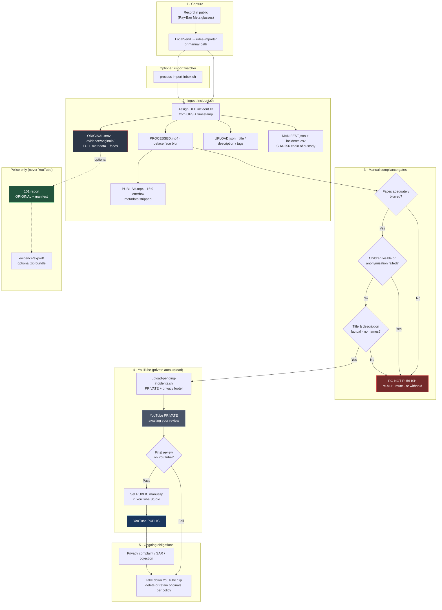

# Reckless Rides UK

Nationwide UK evidence project — public documentation, compliance standards, and ingest tooling for the [@Reckless-Rides-UK](https://www.youtube.com/@Reckless-Rides-UK) YouTube channel. Timestamped evidence of dangerous and illegal cycling wherever incidents are captured: pavement, footpath, and road.

**Nationwide UK · Awareness · Evidence · Change**

| | |
|---|---|
| **Operator / controller** | **Dynamic Devices Ltd** (England & Wales) |
| **ICO registration** | **Dynamic Devices Limited · ZC180994** (Tier 1 micro; fee paid 23 Jun 2026) |
| **Site** | [recklessrides.uk](https://recklessrides.uk) (incident map) |
| **Repo** | [github.com/DynamicDevices/reckless-rides-uk](https://github.com/DynamicDevices/reckless-rides-uk) |
| **Shared core** | [evidence-core](https://github.com/DynamicDevices/evidence-core) (git submodule at `core/`) |
| **Compliance** | [COMPLIANCE-STATEMENT.md](COMPLIANCE-STATEMENT.md) |
| **Privacy / takedown** | [ajlennon@dynamicdevices.co.uk](mailto:ajlennon@dynamicdevices.co.uk) |

**Video evidence is never stored in this repository** (see `.gitignore`). `*_UPLOAD.json` metadata (titles, descriptions, tags, YouTube URLs — no faces or video) **is** tracked for transparency and powers the public map.

Incident IDs use the legacy **`DEB-`** prefix (unchanged after rebrand).

## Compliance & standards (public)

**Link this section from your YouTube channel About box.**

| Document | Audience | URL |
|----------|----------|-----|
| **[Compliance & standards statement](COMPLIANCE-STATEMENT.md)** | Complainants, YouTube, police | `https://github.com/DynamicDevices/reckless-rides-uk/blob/main/COMPLIANCE-STATEMENT.md` |
| **[Incident map](https://recklessrides.uk/)** | Public map of uploaded incidents | [recklessrides.uk](https://recklessrides.uk) (GitHub Pages + custom domain) |
| [UK compliance record](UK-COMPLIANCE.md) | Full GDPR/legal operating detail | `https://github.com/DynamicDevices/reckless-rides-uk/blob/main/UK-COMPLIANCE.md` |
| [Publication workflow](#publication-workflow-privacy--compliance) | How clips are anonymised before going public | This README |

**Privacy / takedown / feedback:** [ajlennon@dynamicdevices.co.uk](mailto:ajlennon@dynamicdevices.co.uk)

We welcome constructive feedback to ensure we meet all legal and platform obligations.

## Publication workflow (privacy & compliance)

Mandatory path from capture to upload. **Never skip the manual gates.** Full legal context: [`UK-COMPLIANCE.md`](UK-COMPLIANCE.md).



| Stage | Privacy / legal control |
|-------|-------------------------|
| **ORIGINAL** | Never uploaded; gitignored; identifiable data retained only for police / defence |
| **PROCESSED** | Face blur (`deface`); human review before any publish decision |
| **PUBLISH** | No embedded GPS/device metadata; **1920×1080 letterbox**; only this file goes to YouTube |
| **UPLOAD.json** | Factual text from templates; default **`private`**; set **`public`** in Studio after review |
| **MANIFEST** | Integrity hashes; documents what was shared with police |
| **Gates** | See [UK-COMPLIANCE.md §12](UK-COMPLIANCE.md#12-per-incident-checklist) checklist |
| **Complaints** | See [UK-COMPLIANCE.md §9](UK-COMPLIANCE.md#9-individual-rights--procedure) |

## Layout

```
reckless-rides-uk/
  core/                  evidence-core git submodule (metadata probe, manifest, geojson)
  branding/              Channel art and watermark (YouTube-sized PNGs)
  channel/               Copy-paste text for YouTube Studio + upload templates
  config/                import-inbox.conf, OAuth secrets (gitignored; see .example)
  docs/                  GitHub Pages site + incident map (Leaflet + GeoJSON)
  .github/workflows/     Pages CI (build map, deploy docs/)
  evidence/
    originals/           Full metadata, identifiable faces — POLICE ONLY
    processed/           Face-blurred review copies (gitignored) + *_UPLOAD.json (tracked)
    publish/             Metadata-stripped — upload these to YouTube
    export/              Optional zip bundles for 101 handover
  register/
    incidents.csv        Master log (gitignored — copy from .example on first run)
    manifests/           Per-incident JSON with SHA-256 hashes
  scripts/
    ingest-incident.sh              Full ingest pipeline
    republish-incident.sh           Re-letterbox + metadata (fix Shorts / wrong aspect)
    process-import-inbox.sh         One-shot scan of glasses import inbox
    watch-import-inbox.sh           Poll inbox (used by systemd)
    upload-pending-incidents.sh     Upload ingested clips missing a YouTube URL
    install-import-watcher.sh       Enable import watcher service
    regenerate-upload-metadata.sh   Rebuild *_UPLOAD.json from manifest
    upload_metadata.py              Channel templates → YouTube metadata builder
    update-youtube-metadata.py      Update title/description/tags on uploaded videos
    upload-incident.sh              Upload *_PUBLISH.mp4 via YouTube API
    youtube-upload.py               Upload implementation
    build-map-data.py               *_UPLOAD.json → docs/data/incidents.geojson
    install-pre-commit.sh           Install git pre-commit hooks
    pre-commit-check.sh             Run all hooks manually
  .pre-commit-config.yaml           Hooks: map build, JSON, shell, YAML, path checks
```

## evidence-core integration

Metadata probing, chain-of-custody manifests, and the public incident map are built on the shared **[evidence-core](https://github.com/DynamicDevices/evidence-core)** library (git submodule at `core/`).

| Script | Uses core for |
|--------|----------------|
| `ingest-incident.sh` | Probe source MOV (GPS, time, device); write manifest |
| `build-map-data.py` | `*_UPLOAD.json` → `docs/data/incidents.geojson` |

**Existing clone** — initialise the submodule after pull:

```bash
git submodule update --init --recursive
pip install -e "./core[dev]"
```

**Probe any file** (glasses clip, test phone media):

```bash
probe-media /path/to/video.MOV
```

## Filename convention

Each incident gets a sequential ID and consistent prefix:

```
DEB-{UTC}_{LAT}_{LON}_{NNN}_{ROLE}.{ext}
```

Example:

```
DEB-20260623T080303Z_53.4092N_2.9778W_001_ORIGINAL.mov   ← police evidence
DEB-20260623T080303Z_53.4092N_2.9778W_001_PROCESSED.mp4  ← review (blurred)
DEB-20260623T080303Z_53.4092N_2.9778W_001_UPLOAD.json   ← YouTube title/description/tags
DEB-20260623T080303Z_53.4092N_2.9778W_001_PUBLISH.mp4   ← YouTube upload
DEB-20260623T080303Z_53.4092N_2.9778W_001_MANIFEST.json ← register/manifests/
```

- **DEB** — dossier prefix for handover
- **UTC** — `com.apple.quicktime.creationdate` from glasses
- **LAT/LON** — from ISO6709 GPS tag
- **NNN** — incident sequence (`001`, `002`, …) from `register/incidents.csv`
- **ROLE** — `ORIGINAL` | `PROCESSED` | `PUBLISH` | `UPLOAD` (JSON metadata, lives with processed)

## Prerequisites

```bash
git clone --recurse-submodules git@github.com:DynamicDevices/reckless-rides-uk.git
cd reckless-rides-uk
pip3 install --user deface
python3.10 -m pip install --user -r requirements-youtube.txt   # YouTube API (systemd/import watcher)
pip3 install -e "./core[dev]"                     # optional: probe-media CLI
# ffmpeg/ffprobe already on system
```

## Ingest a new clip

Copy or transfer from glasses/LocalSend, then:

```bash
./scripts/ingest-incident.sh /path/to/video.MOV "optional notes"
```

This will:

1. Copy the source to `evidence/originals/` with the controlled name
2. Blur faces (`deface`) → `evidence/processed/`
3. Strip metadata and **letterbox to 16:9** (1920×1080) → `evidence/publish/` — avoids YouTube Shorts classification
4. Write `evidence/processed/*_UPLOAD.json` (YouTube title, description, tags)
5. Write `register/manifests/*_MANIFEST.json` (SHA-256 per file)
6. Append a row to `register/incidents.csv`

**Upload `*_PUBLISH.mp4` to YouTube as `private`.** After review on YouTube, set **`public`** manually in Studio.  
**Give police `*_ORIGINAL` + manifest** if you report via 101.

### Glasses import inbox (automatic)

Copy clips from Ray-Ban Meta glasses via LocalSend into:

```
/home/ajlennon/LocalSend/rides-imports/
```

New `.MOV` / `.mp4` files are **auto-ingested** (face blur, register, manifest). After ingest the source moves to `rides-imports/done/` and **`PUBLISH.mp4` is uploaded to YouTube as private** automatically.

You still review on YouTube Studio and set **public** manually when ready. Nothing uploads as public without `--confirm-public-bypass`.

Then update the public map (sync privacy, commit metadata, deploy site):

```bash
./scripts/publish-map-metadata.sh
```

**One-time setup:**

```bash
./scripts/install-import-watcher.sh
```

This enables a user systemd service that polls the inbox every 10 seconds. Processed sources move to `rides-imports/done/`; failures go to `rides-imports/failed/`.

**Manual one-shot** (without the watcher):

```bash
./scripts/process-import-inbox.sh
```

**Status / logs:**

```bash
systemctl --user status reckless-rides-import-watcher.service
tail -f register/import-inbox.log
```

Config: copy `config/import-inbox.conf.example` → `config/import-inbox.conf` to change inbox path, poll interval, or `AUTO_YOUTUBE_UPLOAD=false` to disable YouTube automation. Map publish is **manual after Studio review** by default (`AUTO_PUBLISH_MAP=false`).

**Upload backlog manually:**

```bash
./scripts/upload-pending-incidents.sh
```

### YouTube upload (automated)

**One-time setup** (Google Cloud):

1. [Google Cloud Console](https://console.cloud.google.com/) → create project → enable **YouTube Data API v3**
2. **OAuth consent screen** → External → add scopes `youtube.upload` and `youtube` → add your Google account as **test user**
3. **Credentials** → Create **OAuth client ID** → **Desktop app** → download JSON
4. Save as `config/client_secret.json` (see `config/client_secret.json.example`)
5. First upload opens a browser to authorise; token saved to `config/youtube-token.json` (gitignored)

Playlist name from `channel/upload-playlist.txt` (**Reckless Rides UK 2026**). Upload creates the playlist if missing; one-time backfill for existing videos:

```bash
./scripts/ensure-youtube-playlist.sh
```

**After ingest + review of `*_PROCESSED.mp4`:**

```bash
# Dry run
./scripts/upload-incident.sh DEB-20260623T080303Z_53.4092N_2.9778W_001 --dry-run

# Upload private (default)
./scripts/upload-incident.sh DEB-20260623T080303Z_53.4092N_2.9778W_001
```

Updates `*_UPLOAD.json` (top-level `youtube_url` plus `youtube.video_id`, `youtube.url`, `youtube.studio_url`, `youtube.uploaded_utc`), `register/incidents.csv`, and manifest. Default quota ~6 uploads/day.

**Manual alternative:** YouTube Studio → upload `*_PUBLISH.mp4` using text from `*_UPLOAD.json`.

Regenerate upload metadata after editing channel templates:

```bash
./scripts/regenerate-upload-metadata.sh DEB-20260623T080303Z_53.4092N_2.9778W_001
```

**Update existing YouTube videos** (title, description, tags from `*_UPLOAD.json` — no re-upload):

```bash
./scripts/update-youtube-metadata.py --all
# or one incident:
./scripts/update-youtube-metadata.py DEB-20260623T080303Z_53.4092N_2.9778W_001 --dry-run
```

Templates live in `channel/` — contact email, compliance URL, title/description templates, tags, playlist.

### Fix Shorts / wrong aspect ratio

Portrait clips from the glasses may be classified as **YouTube Shorts** (limited description visibility). The ingest pipeline letterboxes to **1920×1080**. If you uploaded before that fix:

1. Delete the Short in YouTube Studio (or leave private and ignore)
2. Rebuild publish copy and metadata:

```bash
./scripts/republish-incident.sh DEB-20260623T080303Z_53.4092N_2.9778W_001
./scripts/upload-incident.sh DEB-20260623T080303Z_53.4092N_2.9778W_001
```

3. Confirm the new upload appears under **Content → Videos**, not **Shorts**

After upload, add `police_ref` to `incidents.csv` and the manifest when reported via 101.

## YouTube & legal compliance (summary)

This project is designed to stay within **UK GDPR** and **YouTube Community Guidelines**. Key controls:

| Area | What we do |
|------|------------|
| **GDPR** | Legitimate interests + minimisation; face blur; private-first upload; takedown process |
| **Harassment** | No naming, no vigilante language, no repeated targeting of one rider |
| **Privacy** | Originals never published; metadata stripped; contact on every video |
| **YouTube CGT** | Factual titles; **comments disabled** (2026-06-23); engage with platform notices |
| **Shorts risk** | 16:9 letterbox so descriptions and compliance footer are searchable |

Full detail: [`COMPLIANCE-STATEMENT.md`](COMPLIANCE-STATEMENT.md) (external) and [`UK-COMPLIANCE.md`](UK-COMPLIANCE.md) (operating record).

**Compliance baseline (2026-06-24):** ICO register **ZC180994** (Dynamic Devices Limited, Tier 1 micro); Appendix A LIA signed in `UK-COMPLIANCE.md`.

## Incident map (GitHub Pages)

Public map of uploaded incidents: **https://recklessrides.uk/** (canonical) · also **https://dynamicdevices.github.io/reckless-rides-uk/**

Built from `*_UPLOAD.json` (YouTube URL required). Pins show incident metadata and **link to YouTube** — no video embedded on the map site.

On each push to `main`, GitHub Actions checks out **`core/` recursively**, runs `scripts/build-map-data.py`, and deploys `docs/`. If Pages CI fails with `No module named 'evidence_core'`, run `git submodule update --init --recursive` locally and ensure `.github/workflows/pages.yml` uses `submodules: recursive`.

**First-time setup:** repo **Settings → Pages → Build and deployment → Source: GitHub Actions**.

### Custom domain (recklessrides.uk)

**Status (June 2026):** DNS on Cloudflare (grey cloud / DNS only). **https://recklessrides.uk** is live with GitHub Pages TLS (`https_enforced: true`). **www** redirects to the apex.

`docs/CNAME` contains `recklessrides.uk`. Nameservers: Cloudflare (`brit.ns.cloudflare.com`, `jihoon.ns.cloudflare.com`).

**Cloudflare DNS** (Dashboard → **DNS** → **Records**). Set every record below to **DNS only** (grey cloud, **not** proxied) — Cloudflare proxy breaks GitHub Pages TLS.

| Type | Name | Content | Proxy |
|------|------|---------|-------|
| **A** | `@` | `185.199.108.153` | DNS only |
| **A** | `@` | `185.199.109.153` | DNS only |
| **A** | `@` | `185.199.110.153` | DNS only |
| **A** | `@` | `185.199.111.153` | DNS only |
| **CNAME** | `www` | `dynamicdevices.github.io` | DNS only |

Optional IPv6: four **AAAA** `@` records to `2606:50c0:8000::153` … `2606:50c0:8003::153` (also DNS only). Apex **CNAME** to `dynamicdevices.github.io` works on Cloudflare via CNAME flattening, but four **A** records match GitHub’s documented setup.

**Verify DNS** (after propagation, up to 24 h):

```bash
dig recklessrides.uk +noall +answer -t A
dig www.recklessrides.uk +noall +answer -t CNAME
```

**GitHub Pages** (custom domain `recklessrides.uk`, build via Actions):

1. DNS checks pass in repo **Settings → Pages → Custom domain**.
2. **Enforce HTTPS** is enabled — share **https://recklessrides.uk/** (not `http://`).
3. **https://www.recklessrides.uk/** redirects to the apex.

**Local preview:**

```bash
python3 scripts/build-map-data.py
python3 -m http.server 8765 --directory docs
# open http://localhost:8765
```

## Pre-commit checks

Hooks catch map-data, JSON, shell, and workflow YAML issues before push (mirrors the Pages CI build step).

**Install once:**

```bash
./scripts/install-pre-commit.sh
# or: pip3 install --user pre-commit && pre-commit install
```

**Manual run** (all files, no commit required):

```bash
./scripts/pre-commit-check.sh
# or: pre-commit run --all-files
```

| Hook | What it checks |
|------|----------------|
| `build-map-data.py` | `*_UPLOAD.json` → `docs/data/incidents.geojson`; fails if geojson is out of sync |
| `check-json` | Valid JSON in staged `*_UPLOAD.json` and `incidents.geojson` |
| `bash -n` | Shell syntax for `scripts/*.sh` |
| `check-yaml` | `.github/workflows/*.yml` |
| `py_compile` | Python syntax for `scripts/*.py` |
| `no /home/ paths` | Staged `*_UPLOAD.json` must use repo-relative paths |

## Police handover

For each reported incident, provide:

- `evidence/originals/DEB-…_ORIGINAL.mov`
- `register/manifests/DEB-…_MANIFEST.json`
- `register/incidents.csv` (or a printout of the matching row)

Manifest includes SHA-256 hashes so integrity can be checked.

Optional export:

```bash
INC=DEB-20260623T080303Z_53.4092N_2.9778W_001
zip -j "evidence/export/${INC}_police_bundle.zip" \
  "evidence/originals/${INC}_ORIGINAL.mov" \
  "register/manifests/${INC}_MANIFEST.json"
```

## Channel copy

Studio text lives in `channel/` — `description.txt`, `guidelines.txt`, `upload-tags.txt`, etc.

Upload metadata templates: `upload-title-template.txt`, `video-description-header.txt`, `video-description-footer.txt`, `upload-playlist.txt`.

## Branding (YouTube Studio)

| Asset | File |
|-------|------|
| Profile picture (800×800) | `branding/reckless-rides-channel-icon-800x800.png` |
| Banner (2560×1440) | `branding/reckless-rides-channel-banner-2560x1440.png` |
| Video watermark (150×150) | `branding/reckless-rides-watermark-150x150.png` |

## Privacy & UK compliance

Evidence **video files** and the incident register CSV are **gitignored**. `*_UPLOAD.json` files are **committed** — they contain publication metadata only (no video, no faces, repo-relative paths).

**Legal & GDPR approach:** [`UK-COMPLIANCE.md`](UK-COMPLIANCE.md) — public operating record (review every six months).

**External statement** (complainants, YouTube, police): [`COMPLIANCE-STATEMENT.md`](COMPLIANCE-STATEMENT.md) — share as PDF, link, or paste into correspondence to demonstrate standards and openness to feedback.

## Releases

Tagged releases document stable ingest/map tooling. Current: **v1.1.0** — evidence-core submodule integration ([releases](https://github.com/DynamicDevices/reckless-rides-uk/releases)).

After checkout of a release tag:

```bash
git submodule update --init --recursive
```
