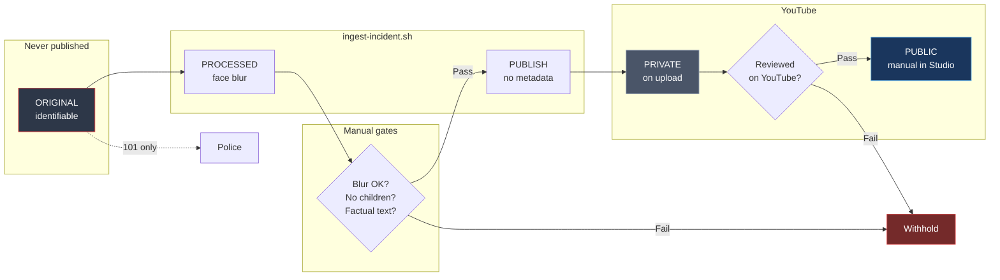

# UK legal & GDPR compliance — Reckless Rides UK

**Status:** living operational document  
**Last reviewed:** 2026-06-23  
**Jurisdiction:** England & Wales (default — confirm if operating elsewhere in the UK)  
**Channel:** [@Reckless-Rides-UK](https://www.youtube.com/@Reckless-Rides-UK)  
**Public site:** [recklessrides.uk](https://recklessrides.uk)  
**Repository:** [github.com/DynamicDevices/reckless-rides-uk](https://github.com/DynamicDevices/reckless-rides-uk)

---

## Important notice

This document records **our intended approach** and **operational controls**. It is **not legal advice**. Data protection and publication law are fact-specific. Before scaling the channel, monetising, or if we receive complaints or regulatory contact, **instruct a solicitor** with UK media/privacy experience.

**Maintainer:** review this document when we change workflow, YouTube visibility, monetisation, or receive a complaint — and at least **every six months**.

---

## 1. What we are doing

| Activity | Description |
|----------|-------------|
| **Capture** | Short video on public streets, via Ray-Ban Meta glasses |
| **Purpose** | Document illegal pavement / footpath riding and dangerous cycling on pavement and road; support pedestrian safety; provide evidence for police (101) where appropriate |
| **Publication** | Anonymised clips uploaded to YouTube as **private** (automated from import inbox or manual script); set **public** manually after review |
| **Transparency** | Public incident map at [recklessrides.uk](https://recklessrides.uk) — metadata only, no video |
| **Retention** | Full originals kept **privately** for possible police handover — **never uploaded** |

We present this as **evidence and road-safety awareness**, not entertainment, “naming and shaming”, or vigilante identification.

---

## 2. Does UK GDPR apply?

**Yes, for public YouTube publication.**

The UK GDPR does not apply to processing “in the course of a purely personal or household activity” ([ICO — domestic purposes](https://ico.org.uk/for-organisations/uk-gdpr-guidance-and-resources/exemptions/a-guide-to-the-data-protection-exemptions/)). That exemption is **narrow**. The ICO has stated that footage posted **publicly online** (beyond friends and family) is **likely in scope**, and the uploader may be a **data controller** ([ICO FOI response on filming in public](https://ico.org.uk/media2/migrated/4029436/response-ic-297521-x4l0.pdf)).

**Implication:** we must comply with UK GDPR and the Data Protection Act 2018 (DPA 2018) for published material and for our private archive of identifiable footage.

### ICO registration

Controllers that process personal data in scope of UK GDPR must pay a fee to the ICO ([registration](https://ico.org.uk/for-organisations/data-protection-fee/register/)).

| Question | Answer / date |
|----------|----------------|
| ICO registration required? | **Yes** — public YouTube publication and private archive of identifiable footage |
| Registered entity | Dynamic Devices Ltd |
| Tier / fee | Tier 1 micro — **£47/year** (direct debit) |
| Registration submitted | **2026-06-23** |
| Direct debit application | **C1966226** (instruction complete; ICO confirms within ~3 working days) |
| Public register reference | _Pending — ICO publishes within ~7 working days; add **Z** reference from confirmation email when received_ |

---

## 3. Our role under UK GDPR

| Term | Us |
|------|-----|
| **Data controller** | **Dynamic Devices Ltd** — decides why and how footage is processed; operated by Alex Lennon ([ajlennon@dynamicdevices.co.uk](mailto:ajlennon@dynamicdevices.co.uk)) |
| **Personal data** | Video/audio in which a person is **identifiable** (face, voice, distinctive clothing, number plate linked to an individual, etc.) |
| **Processing** | Recording, storing, blurring, uploading, describing, sharing with police |

YouTube/Google is a **separate controller** for platform hosting. We remain responsible for what we upload and what we say about it.

---

## 4. Lawful basis for processing

We rely primarily on:

### 4.1 Legitimate interests (Article 6(1)(f) UK GDPR)

**Purpose:** road safety documentation, public interest in unlawful pavement riding and dangerous cycling, and supporting law enforcement with evidence.

We apply the ICO three-part test ([legitimate interests guidance](https://ico.org.uk/for-organisations/uk-gdpr-guidance-and-resources/lawful-basis/legitimate-interests/)):

1. **Purpose** — document a genuine safety/highway issue; not harassment or commercial exploitation of individuals.  
2. **Necessity** — publication is limited to short, anonymised clips; originals only retained for police/reporting.  
3. **Balancing** — we reduce impact on bystanders and riders via **face blur**, **no naming**, **private-until-reviewed** uploads, and **takedown** on request.

**Action:** complete and retain a **Legitimate Interests Assessment (LIA)** per Appendix A when we publish routinely.

### 4.2 Journalistic exemption (DPA 2018, Schedule 2 Part 5 para 26)

May apply where processing is **with a view to publication** of journalistic material and we **reasonably believe** publication is in the **public interest**, balancing freedom of expression ([ICO journalistic purposes](https://ico.org.uk/for-organisations/uk-gdpr-guidance-and-resources/exemptions/a-guide-to-the-data-protection-exemptions/)).

**Caution:** this is **not a free pass** for individuals operating a themed YouTube channel. Do not assume it applies without legal advice. Our **primary** documented basis is **legitimate interests** with strong minimisation.

### 4.3 What we do **not** rely on

| Basis | Why not |
|-------|---------|
| **Consent** | Impractical for random members of the public; withdrawn consent would require deletion — impractical for an evidence log |
| **Legal obligation** | We are not under a statutory duty to film |
| **Domestic/household** | Public channel disqualifies this |

---

## 5. Data protection principles — how we comply

| Principle | Our approach |
|-----------|--------------|
| **Lawfulness, fairness, transparency** | Channel description states purpose, anonymisation, retention, and contact ([`channel/description.txt`](channel/description.txt)); per-video privacy footer in [`channel/video-description-footer.txt`](channel/video-description-footer.txt) |
| **Purpose limitation** | Footage for road-safety evidence and reporting only — not repurposed for unrelated content |
| **Data minimisation** | Publish **blurred** copies only; strip embedded GPS/device metadata from upload files; avoid naming individuals in titles |
| **Accuracy** | No misleading edits; originals preserved; manifests with SHA-256 ([`register/manifests/`](register/manifests/)) |
| **Storage limitation** | See §8 retention — delete when no longer needed |
| **Integrity & confidentiality** | Originals in `evidence/originals/` (gitignored, not in cloud repo); controlled filenames; optional encrypted backup |
| **Accountability** | This document, incident register, manifests, ingest pipeline ([`scripts/ingest-incident.sh`](scripts/ingest-incident.sh)) |

---

## 6. Technical & operational controls

These are **mandatory** before any YouTube upload. **Workflow diagram:** [README.md — Publication workflow](README.md#publication-workflow-privacy--compliance).

| Control | Implementation |
|---------|----------------|
| **Originals never published** | `evidence/originals/*_ORIGINAL.*` |
| **Face anonymisation** | `deface --replacewith blur --mask-scale 1.3` — manual review each clip |
| **Metadata stripped + 16:9 letterbox** | `ffmpeg` scale/pad to **1920×1080** on `*_PUBLISH.mp4` — standard **Videos**, not Shorts |
| **Controlled evidence chain** | `DEB-{UTC}_{LAT}_{LON}_{NNN}_*` naming + manifest SHA-256 |
| **Default private** | `*_UPLOAD.json` → `"privacy": "private"`; set **public** in YouTube Studio after review |
| **No vigilante language** | Channel guidelines; factual titles only |

### Known gaps (mitigate manually)

| Gap | Mitigation |
|-----|------------|
| Face blur misses faces / reflections | Watch full clip before upload; use `--replacewith solid` for children; do not publish if anonymisation fails |
| Audio may identify voices | Consider muting publish copy if voices are clear and not relevant |
| Number plates | Not auto-blurred — blur manually or exclude frames if a plate could identify a **private** individual unrelated to the incident |
| GPS in YouTube description | Street-level incident location only — signed map URLs (`lon` negative for west); not home addresses |
| YouTube Shorts classification | Portrait/short clips become Shorts — **letterbox to 16:9** before upload; confirm under **Videos** in Studio |

### YouTube platform policy (ban / strike risk)

We reduce the risk of Community Guidelines strikes or channel termination by:

| Risk | Control |
|------|---------|
| **Harassment / cyberbullying** | No naming individuals; face blur; no “find this person” commentary; moderate/remove abusive comments |
| **Privacy violations** | Anonymisation pipeline; private-until-reviewed; takedown within 7 days |
| **Vigilante / incitement** | Channel guidelines prohibit confrontation; factual titles (“cycling incident”, time, place) |
| **Repeated targeting** | Do not build series focused on one identifiable rider |
| **Misleading content** | No deceptive edits; originals retained for integrity |
| **Children** | Withhold if anonymisation uncertain |
| **Bypassing review** | Upload script refuses `--public` without explicit `--confirm-public-bypass` |

If YouTube issues a warning or removes a video, **stop publishing** disputed clips, respond via Studio appeals, and update this document.

---

## 7. Transparency & privacy information

Published on the channel (keep in sync with [`channel/description.txt`](channel/description.txt)):

- What we film and why  
- Originals kept privately; uploads anonymised  
- How to request removal  
- Link to police reporting (101) — we do not replace formal reports  

**Contact for data/privacy requests:** [ajlennon@dynamicdevices.co.uk](mailto:ajlennon@dynamicdevices.co.uk) (also set in YouTube Studio).

---

## 8. Retention

| Data | Retention | Deletion trigger |
|------|-----------|------------------|
| **ORIGINAL** | Until no longer needed for police/civil purpose, max **12 months** unless case active | Police case closed + no appeal; or successful erasure request where we have no overriding reason to keep |
| **PROCESSED / PUBLISH** | Align with YouTube upload life | Delete local copies when YouTube video deleted |
| **Register / manifests** | Same as related ORIGINAL | Redact or delete row when incident deleted |
| **YouTube video** | Review annually | Remove if no ongoing purpose or on objection upheld |

**Police handover:** once supplied, note `police_ref` in `register/incidents.csv` and manifest. Retention may extend while investigation proceeds — document the date handed over.

---

## 9. Individual rights — procedure

When someone contacts us (email, YouTube message, comment) saying they appear in footage:

| Right | Our response |
|-------|----------------|
| **Right to be informed** | Point to channel description / this approach |
| **Right of access (SAR)** | Respond within **one month**; confirm what we hold (original/processed/URLs); verify identity before disclosing originals |
| **Right to erasure** | **Published:** remove or re-edit YouTube video promptly if identification possible despite blur. **Originals:** delete unless **legitimate grounds** to retain (e.g. active police investigation, pending complaint we must defend) — seek legal advice if in doubt |
| **Right to object** | Stop processing for publication; take down clip |
| **Right to restrict** | Pause further use while disputing accuracy |

**Takedown log:** record date, requester (verified), action taken, in `register/incidents.csv` notes or a separate `register/takedowns.csv` if volume grows.

**Do not** engage in public arguments on YouTube about identifiable individuals.

---

## 10. Other UK legal responsibilities

GDPR is not the only risk. Public publication engages:

### 10.1 Harassment & stalking

[Protection from Harassment Act 1997](https://www.legislation.gov.uk/ukpga/1997/40/contents) — a **course of conduct** causing alarm/distress may be unlawful even if each clip alone is not. **Controls:** no targeting the same rider across multiple posts; no “find this person” commentary; no following or confrontation while filming.

### 10.2 Communications offences

[Malicious Communications Act 1988](https://www.legislation.gov.uk/ukpga/1988/27/contents) / [Communications Act 2003 s.127](https://www.legislation.gov.uk/ukpga/2003/21/section/127) — threatening or grossly offensive material online. **Controls:** moderate comments; remove abuse.

### 10.3 Defamation

Statements suggesting criminal conduct must be **substantially true** or clearly **opinion/hypothesis**. Prefer **neutral** descriptions: “ridden on the pavement” (observable) not “this criminal” (accusatory). We film **behaviour**, not character.

### 10.4 Privacy (common law / misuse of private information)

Filming in **public** is generally lawful, but publication can still be challenged if highly offensive and not of public interest. **Controls:** anonymisation, no filming into homes/gardens, no prolonged focus on one private individual.

### 10.5 Copyright

We record our own footage. Avoid adding third-party music to evidence clips. YouTube Content ID is separate from GDPR.

### 10.6 Road traffic context (legitimacy of purpose)

Riding a cycle on the pavement may contravene [Highways Act 1835 s.72](https://www.legislation.gov.uk/ukpga/Will4and1/5-6/50/section/72) (as applied to cyclists). E-bikes may also fall under [Road Traffic Act 1988](https://www.legislation.gov.uk/ukpga/1988/1/contents) depending on classification. This supports **public interest** in documentation but **does not** grant immunity from privacy or harassment law.

### 10.7 Children

Extra care for under-18s identifiable in footage. **Do not publish** if effective anonymisation is uncertain. ICO [children and the UK GDPR](https://ico.org.uk/for-organisations/uk-gdpr-guidance-and-resources/childrens-information/childrens-code-guidance-and-resources/).

### 10.8 Monetisation

Turning on YouTube monetisation or sponsorship strengthens the argument that activity is **not** purely personal and may increase regulatory and reputational scrutiny. Re-run Appendix A LIA before monetising.

---

## 11. Police & third-party disclosure

| Scenario | Approach |
|----------|----------|
| **Report to 101** | Supply `*_ORIGINAL` + manifest; cite incident ID and SHA-256 |
| **Police request (formal)** | Verify officer identity; document request; disclose minimum necessary |
| **E-bike operator records** | Only police/operators under lawful process — we cannot obtain hire data directly |
| **Insurance / civil claim** | Seek legal advice before disclosing originals |

Disclosure to police is usually a separate lawful basis (**legal obligation** or **legitimate interests** / **vital interests** if imminent harm) — note the disclosure in the incident manifest.

---

## 12. Per-incident checklist

Before upload:

- [ ] Ingested via `scripts/ingest-incident.sh` (not ad-hoc export from Meta app)  
- [ ] Watched full `*_PROCESSED.mp4` — faces blurred; children not identifiable  
- [ ] `*_PUBLISH.mp4` has no GPS/device metadata (`ffprobe` check)  
- [ ] Title/description from `*_UPLOAD.json` — factual, no names, no plate numbers  
- [ ] `*_PUBLISH.mp4` is **1920×1080** (not Shorts format)  
- [ ] Upload **`private`** using `*_UPLOAD.json` metadata  
- [ ] Review clip on YouTube while still **private** — confirm it appears under **Videos**, not **Shorts**  
- [ ] Set **public** in YouTube Studio only after review passes (re-run LIA if you change mind about public visibility)  
- [ ] Privacy footer present in description  
- [ ] Incident row in `register/incidents.csv`  

After upload:

- [ ] Add `youtube_url` to register and manifest  
- [ ] If reported to police: add `police_ref`  

---

## 13. Incident response

| Event | Action |
|-------|--------|
| **Privacy complaint** | Acknowledge within 48h; review clip; take down or re-blur within 7 days; log outcome |
| **ICO enquiry** | Do not ignore; seek legal advice; preserve manifests and this document |
| **Threat of legal action** | Preserve evidence; stop publication of disputed clip; instruct solicitor |
| **Media contact** | No comment on identifiable individuals; refer to channel purpose statement |

---

## 14. Related project files

| File | Role |
|------|------|
| [`README.md`](README.md) | Evidence workflow + [full publication diagram](README.md#publication-workflow-privacy--compliance) |
| [`COMPLIANCE-STATEMENT.md`](COMPLIANCE-STATEMENT.md) | **External** — for complainants, platforms, police |
| [`channel/guidelines.txt`](channel/guidelines.txt) | Channel rules |
| [`register/incidents.csv`](register/incidents.csv) | Processing record |
| [`register/manifests/*_MANIFEST.json`](register/manifests/) | Integrity & file map |
| [`scripts/upload-incident.sh`](scripts/upload-incident.sh) | YouTube API upload (private default) |
| [`scripts/republish-incident.sh`](scripts/republish-incident.sh) | Re-letterbox + fix metadata after Shorts mistake |
| [`register/takedowns.csv.example`](register/takedowns.csv.example) | Complaint log template |

---

## Appendix A — Legitimate Interests Assessment (template)

Complete one assessment for the **channel programme** (not every clip). Update if practices change.

**Date:** 2026-06-23  
**Reviewer:** Alex Lennon (Dynamic Devices Ltd)

### A1 Purpose

Document unlawful pavement riding and dangerous cycling in the UK to raise awareness and support reporting to police, improving pedestrian and road safety.

### A2 Necessity

Is publication necessary? Could the purpose be achieved without identifiable data?

| Option | Assessment |
|--------|------------|
| Police report only, no YouTube | Achieves enforcement but not awareness/education |
| YouTube with full faces | Disproportionate privacy intrusion |
| **YouTube with blur, private until reviewed, factual metadata** | **Chosen — necessary and proportionate** |

### A3 Balancing — impact on individuals

| Affected group | Impact | Mitigation |
|----------------|--------|------------|
| Rider | May feel observed | Faces blurred on publish; no naming; report to police not mob justice |
| Bystanders | Incidental capture | Face blur; short clips; takedown policy |
| General public | Low | Private on upload; public only after manual Studio review |

### A4 Reasonable expectations

People in public places may expect observation but **not** global publication. Mitigations (blur, private-until-reviewed, limited description) reduce surprise.

### A5 Children

High vulnerability — solid-box blur or withhold publication if any doubt.

### A6 Decision

- [x] Proceed with current controls  
- [ ] Proceed with changes: _______________  
- [ ] Do not publish — reason: _______________

**Sign-off:** Alex Lennon — 2026-06-23

---

## Appendix B — Document change log

| Date | Change | Author |
|------|--------|--------|
| 2026-06-23 | ICO registration submitted (Dynamic Devices Ltd, Tier 1 DD C1966226); Appendix A LIA signed | Alex Lennon |
| 2026-06-23 | Move to DynamicDevices GitHub org; privacy contact ajlennon@dynamicdevices.co.uk; controller Dynamic Devices Ltd | — |
| 2026-06-23 | v1.0 release: nationwide scope, @Reckless-Rides-UK, upload branding pipeline, rides-imports watcher, channel art | — |
| 2026-06-23 | YouTube handle set to @Reckless-Rides-UK | — |
| 2026-06-23 | Documentation refresh: README quick links, auto-pipeline workflow, map/DNS status, pre-commit layout; compliance v1.3 incident map | — |
| 2026-06-23 | Comprehensive review: 16:9 letterbox, map URL fix, YouTube policy section, upload automation, takedown template | — |
| 2026-06-23 | Rebrand to Reckless Rides UK; scope broadened to pavement and road dangerous cycling; recklessrides.uk custom domain | — |

---

## Appendix C — Useful links

- [ICO guide for individuals](https://ico.org.uk/for-the-public/)  
- [ICO lawful basis](https://ico.org.uk/for-organisations/uk-gdpr-guidance-and-resources/lawful-basis/)  
- [ICO legitimate interests](https://ico.org.uk/for-organisations/uk-gdpr-guidance-and-resources/lawful-basis/legitimate-interests/)  
- [ICO exemptions (domestic / journalistic)](https://ico.org.uk/for-organisations/uk-gdpr-guidance-and-resources/exemptions/a-guide-to-the-data-protection-exemptions/)  
- [Police.uk — contact the police](https://www.police.uk/pu/contact-the-police/)  
- [Highway Code — rules for cyclists](https://www.gov.uk/guidance/the-highway-code/rules-for-cyclists-including-electric-bikes)
